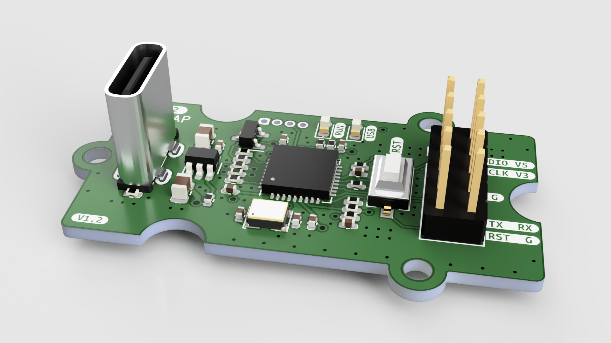

0102-TILEDAP
==========

一个 DAPLink 调试器，附带 USB-UART 桥接功能。

## 特性

1. 使用 STM32F103TBU6 小封装
2. 实体 nRESET 键，用于复位目标 MCU，或长按进入 TILEDAP 自身的拖拽更新模式
3. 引出了一对 UART TX/RX，可通过免驱的 USB CDC-ACM 读取目标 MCU 串口日志

## 协议

[CERN-OHL-P-2.0](LICENSE)
